# Housing Cost & Industry Type Correlation DashBoard

  The <strong>Housing Cost & Industry Type Correlation Dashboard</strong> features an interactive interface that compares 
  <strong>median housing costs</strong> across California counties with <strong>industry composition</strong> 
  (e.g., Local Government, Manufacturing, Finance, and more). 
  Users can explore trends, customize filters, and draw their own insights through rich, data-driven visualizations.

---

## Table of Contents
- [Installation](#installation)
- [Getting Started](#getting-started)
- [Feature 1 - Dashboard Menu](#feature-1---dashboard-menu)
- [Feature 2 - County Map](#feature-2---county-map)
- [Feature 3 - Bar Chart](#feature-3---bar-chart)
- [Feature 4 - Multi-Line Chart](#feature-4---multi-line-chart)
- [Feature 5 - Scatter Plot](#feature-5---scatter-plot)
- [Feature 6 - Bubble Chart](#feature-6---bubble-chart)
- [Feature 7 - Box Plot](#feature-7---box-plot)
- [Feature 8 - Violin Chart](#feature-8---violin-chart)
- [Technologies](#technologies)

## Installation

## Getting Started

  The main feature of this dashboard is its <strong>multi-functionality</strong>. 
  It’s not limited to exploring correlations between a single industry and one type of chart 
  instead, users can <strong>select and customize their own data, industries, and visualization types</strong> 
  to explore patterns and <strong>draw their own conclusions</strong>. 
  This flexibility allows for a truly interactive and personalized data analysis experience.

  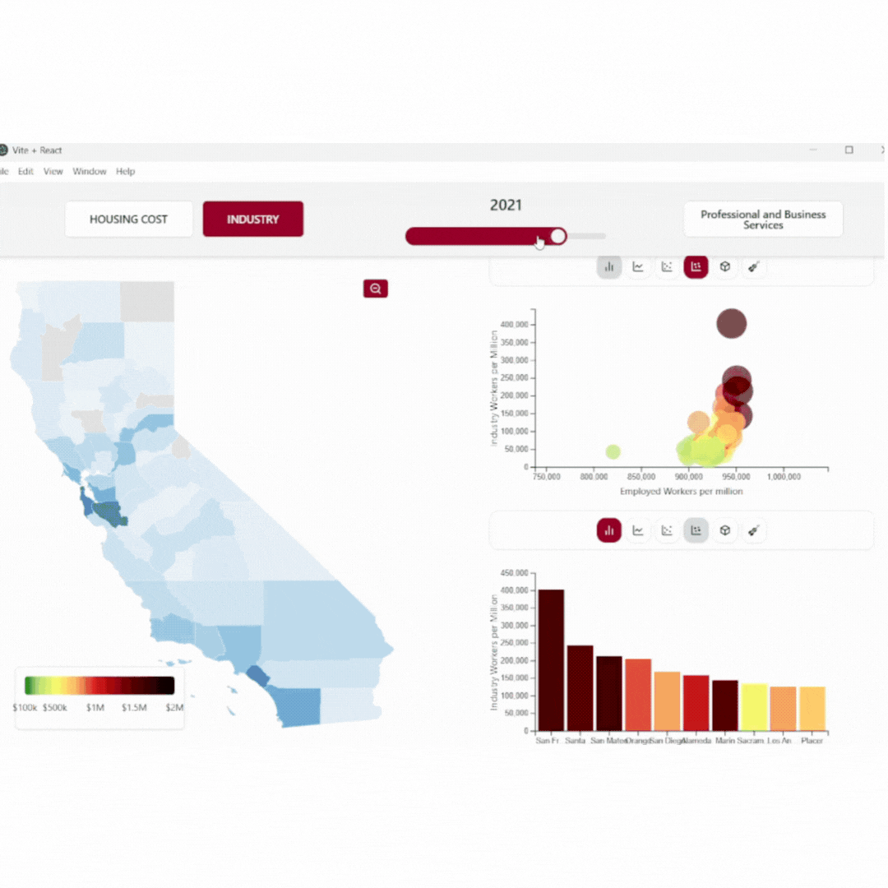

## Feature 1 - Dashboard Menu

  At the top of the dashboard is the <strong>selection menu</strong>, 
  where users can choose which features or data visualizations to display. 
  Depending on the selected chart type, the displayed data automatically 
  updates and adjusts <strong>dynamically</strong> to reflect those choices.

  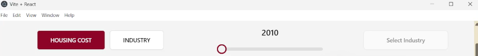

  Below is the <strong>mode selection menu</strong>, which allows users to switch between 
  <strong>Housing Mode</strong> and <strong>Industry Mode</strong>. 
  This feature dynamically updates visualizations such as the <strong>County Map</strong>, 
  <strong>Box Plot</strong>, and <strong>Violin Chart</strong> based on the selected mode.

  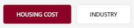

  The <strong>scroll wheel</strong> controls the <strong>year of data</strong> displayed, 
  allowing users to explore information from <strong>2010 to 2024</strong>. 
  Adjusting the year dynamically updates visualizations such as the 
  <strong>County Map</strong>, <strong>Bar Chart</strong>, and <strong>Bubble Chart</strong>.

  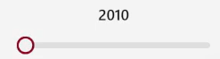

  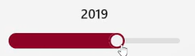

  Finally, in the <strong>header menu</strong> is the <strong>Industry Selection</strong> dropdown. 
  Some charts require an industry type to be selected in order to display data — 
  otherwise, no visualization will appear. 
  To activate this dropdown, make sure <strong>Industry Mode</strong> is enabled.

  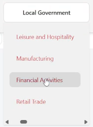

  Below are two mini <strong>selection menus</strong> that allow you to choose which charts you want to view. 
  Keep in mind that you cannot select the same chart twice (e.g., two <strong>Box Plots</strong>). 
  The charts must be <strong>different</strong> to be displayed simultaneously.

  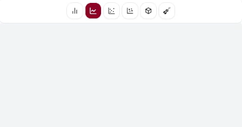

## Feature 2 - County Map

  Below is the <strong>County Map</strong>, which displays a heat map of each California county 
  based on either <strong>median housing cost</strong> or <strong>industry type per million</strong>. 
  You can switch between these views by selecting the desired mode from the menu at the top. 
  The map supports interactive features — you can <strong>click</strong> to zoom in on specific counties, 
  and their details will appear in the top-left corner. 
  You can also <strong>hover</strong> over a county to quickly view its information.

  <strong>Housing Map</strong>

  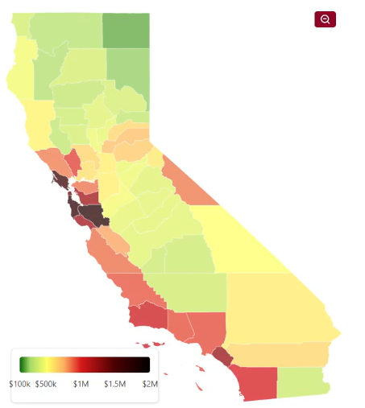

  <strong>Industry Map (Manufacturing)</strong>

  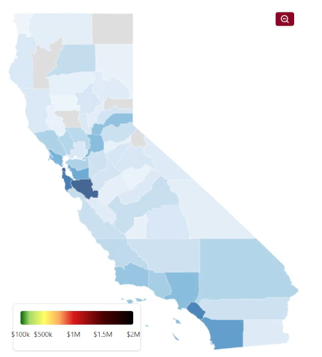

  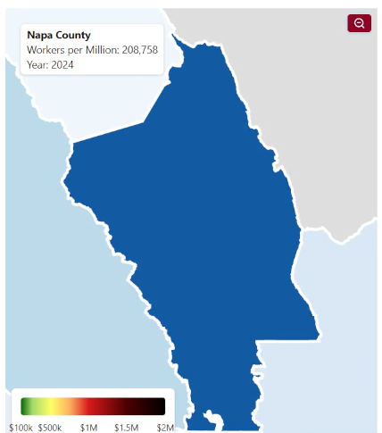

  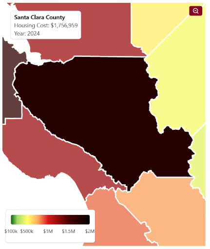

## Feature 3 - Bar Chart

## Feature 4 - Multi-Line Chart

## Feature 5 - Scatter Plot

## Feature 6 - Bubble Chart

## Feature 7 - Box Plot

## Feature 8 - Violin Chart

## Technologies

